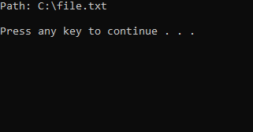

# FORCEDELETE
An application that allows you to delete a file, even when it is in use in another program. Useful for deleting "locked" files. To use the application, run it, and then paste the path to the file. It may be helpful to run the application as administrator. 
 

# Usage
1. Compile it
2. Run the .exe
3. Input path to the directory you want to delete

# Legal
Developer assume no liability and are not responsible for any misuse or damage caused by FORCEDELETE.

# Author
Filip Rokita 
www.filiprokita.com